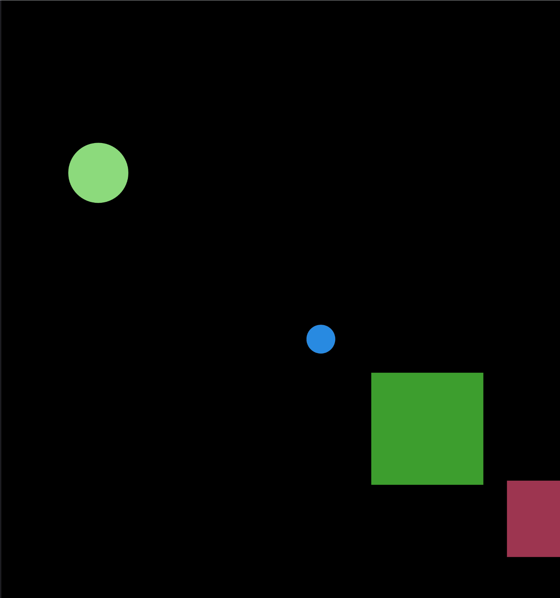
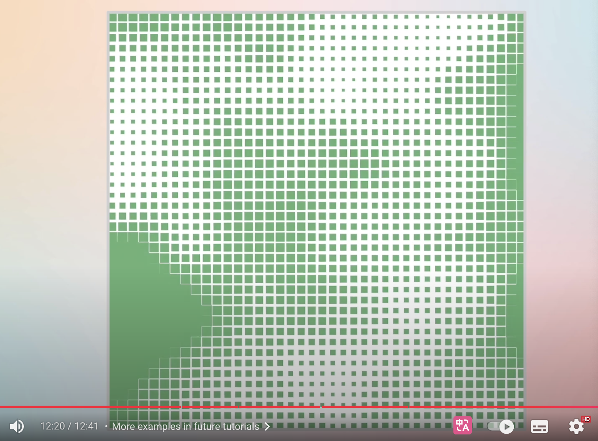

# **Functioning prototype**

## **1. Interaction Instructions**

### Once the page loads, the animation will start automatically—no click required. Here's what you can expect:
- Although the animation is mostly autonomous, the visuals remain responsive to the full canvas size. Try resizing your browser window—the entire composition will scale smoothly to fit.
- Press the spacebar to regenerate the animated layout:
Every time you press it, all split circles will change their position drift, rotation angle, and splitting ratio—giving you a fresh new visual every time.
- Over time, you’ll notice that different parts of the image breathe, float, and ripple gently. No user action is needed for these animations—they evolve naturally through noise-based motion.
### This piece is designed to be meditative and alive—just sit back, watch it drift, and enjoy the ambient rhythm.

## **2. Details of my individual approach to animating the group code**

### I chose Perlin noise to drive my personal code.

###  Introduction to Image Animation：
#### SplitCircle Animation (Class: SplitCircle)
- Animated Properties:
  - Position drift (x, y)
Uses Perlin noise to create smooth floating motion in both axes, making each circle gently drift.
  - Dynamic angle rotation (angle)
The splitting line between colors rotates over time, driven by noise, creating an ever-changing color split.
  - Radius pulsing (r)
A subtle breathing effect is achieved using a sine wave to make the circle expand and contract slightly.
- Visual Effect:
A two-colored circle that gently drifts, breathes, and rotates its split angle—giving a lively and organic motion.

#### Rect Animation (Class Rect)
- Animated Properties:
  - Width & height changes
The rectangle pulsates with time using a sine wave, simulating expansion and contraction.
  - Unique rhythm & amplitude per rectangle
Each rectangle has its own speed and phase to avoid uniformity, enhancing natural movement.
- Visual Effect:
  - Blocks that rhythmically “breathe” or pulse, with soft corner rounding. The fill and border colors remain static.

#### HalfCircle Animation (Class: HalfCircle)
- Animated Properties:
  - Vertical floating (y)
Sine-based up-and-down movement gives the illusion of gentle floating.
  - Desynchronized motion
Each half-circle has an individual phase shift based on its x position, so they don’t all float together.
- Visual Effect:
  - Semicircles that gently bob up and down like buoys, adding a sense of depth and rhythm to the layout.

#### Animated Background Grid (Function: drawDynamicBackground())
- Animated Properties:
  - Color interpolation per cell
Each square's color shifts between two preset tones using Perlin noise over time.
  - Size oscillation per cell
Noise also controls the dynamic resizing of each square—some shrink, some grow—creating a lively grid.
- Visual Effect:
  - A gently fluctuating background grid of soft, shifting colors and sizes, contributing subtle motion to the whole canvas.

####  Interactive Re-randomization (Function: keyPressed() (press spacebar))
- Behavior:
  - Regenerates randomSeed() and noiseSeed()
  - Rebuilds all SplitCircle properties (e.g. angle, ratio, motion)
  - Refreshes the entire animation pattern and structure

### References to inspiration for animating my individual code
#### My inspiration mainly comes from two aspects：
- The first inspiration came from the course "Noisy Shapes", which uses Perlin noise to generate shapes that move across the screen. The use of basic shapes (circles, squares) with subtle motion informed the idea of giving "life" to otherwise static graphics through float, pulse, and drift behaviors. This inspired the modular elements in my design to move independently yet harmoniously.

- The second inspiration came from a video about perilin noise on YouTube. Generate disco-like artworks using 2D and 3D noise patterns. The second image depicts a dynamic effect where a pixel-like grid structure continuously changes over time. This visual language inspired me to transform it into a response to the background fabric texture in "Apple Tree" - I attempted to simulate a sense of fabric that undulates over time, gradually being "eroded" or softened by time, through the use of a dynamic grid, in order to express the metaphorical theme of memory and cultural flow behind the work.

### A short technical explanation
- Tools and technique from outside the course
  - Although the dynamic grid animation in the background was not part of the original course material, I intentionally incorporated it to enhance the atmosphere of the composition and bring additional depth to the visual storytelling.

  This background is inspired by the textile-like geometry found in Anwar Jalal Shemza’s Apple Tree. I wanted to reinterpret the feeling of woven fabric slowly shaped by time, as if the structure behind the artwork was constantly shifting, stretching, or fading—reflecting memory and cultural change.

  The grid is made up of hundreds of tiny squares, and their size and color change over time using Perlin noise:

  Each square’s size: controlled by 3D noise (x, y, time) to fluctuate smoothly.

  Each square’s color: interpolated between two tones based on the same noise value, creating a soft shimmering effect.
  
  Result: an organic, breathing grid that continuously shifts like flowing fabric in slow motion.

  Reference: [Link Disco Grid](https://www.youtube.com/watch?v=XevTlomtG3g)

